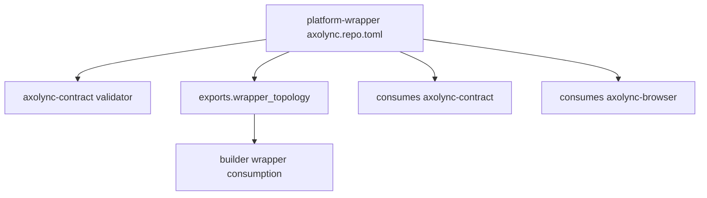

# Design Document

## Overview

`axolync-platform-wrapper` becomes a descriptor-described mixed repo. Its descriptor exposes wrapper topology and generated wrapper outputs while declaring required dependencies on `axolync-contract` and browser.

## Architecture



## Components and Interfaces

### Descriptor

The wrapper descriptor should include:

- `repo.id = "axolync-platform-wrapper"`
- `repo.roles = ["consumer", "consumable"]`
- source/bootstrap/docs/test exports
- `exports.wrapper_topology`
- generated outputs modeled as exports
- consumes entries for `axolync-contract` and `axolync-browser`

### Wrapper Topology Export

`exports.wrapper_topology` should describe active wrapper families:

- `desktop/tauri`
- `desktop/electron`
- `mobile/capacitor`

It should reference canonical repo paths under `wrappers/<type>/<wrapper_name>/...`.

### Browser Boundary

Only builder/wrapper consumers need topology. Browser should not import or interpret the wrapper topology block.

## Data Models

```ts
interface WrapperTopologyExport {
  families: Array<{
    type: 'desktop' | 'mobile';
    name: string;
    path: string;
    workspaceTemplatePath?: string;
    nativeCompanionPath?: string;
  }>;
}
```

## Error Handling

- Missing required contract/browser dependency fails wrapper validation.
- Missing topology paths fail when builder requires wrapper artifact generation.
- Generated output represented as a consumed repo fails validation.
- Browser coupling to wrapper topology fails guardrail tests.

## Testing Strategy

- Descriptor validation tests for platform-wrapper.
- Topology export tests for canonical paths.
- Builder consumption fixture tests for `exports.wrapper_topology`.
- Guardrail tests ensuring browser does not read wrapper topology.
