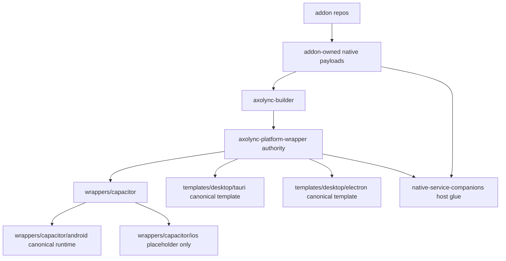

# Design Document

## Overview

This design completes the wrapper authority's physical source migration. The earlier wrapper authority work created the authority vocabulary and transition scaffolding. This design defines the finish line: canonical source must move into the wrapper authority repo, and tests must reject placeholder-only completion.

The target repo identity remains `axolync-platform-wrapper`. The local repo may still be checked out as `axolync-android-wrapper` before the GitHub/local folder rename happens, but the implementation must shape the code as the future wrapper authority.

## Architecture



## Canonical Source Layout

The wrapper authority should publish deterministic paths:

```text
wrappers/
  capacitor/
    android/
      app/
      gradle/
      scripts/
      signing/
      capacitor.config.json
    ios/
      README.md
    shared/
      README.md
templates/
  desktop/
    tauri/
      package.json
      src-tauri/
    electron/
      package.json
      main.cjs
      preload.cjs
      nativeServiceCompanionHost.cjs
native-service-companions/
  host-protocol/
  deployment/
  diagnostics/
config/
  wrapper-layout.json
  wrapper-authority.json
```

Exact file placement may follow tool constraints, but active Android runtime and desktop templates must be canonical in the wrapper repo.

## Android Rehome Strategy

Android/Capacitor files should move under `wrappers/capacitor/android`. If Android or Gradle tooling cannot tolerate a complete physical move in one step, root-level files may remain as thin shims. A shim is valid only if it delegates to canonical source and is tested as such.

Examples of allowed shims:

- root Gradle settings that include the canonical Android project
- root scripts that call scripts under `wrappers/capacitor/android`
- root config files that are generated or copied from canonical source

Examples of invalid final state:

- root `app` remains the only real Android app source
- `wrappers/capacitor/android` contains only README files
- tests pass because they only check that placeholder folders exist

## Desktop Template Rehome Strategy

The wrapper repo must contain canonical Tauri and Electron template roots. Builder may later consume these through its cutover seed, but this repo must first publish real source.

The wrapper-owned templates should include the full project skeletons needed by builder:

- package manifests
- Tauri `src-tauri` source/config
- Electron main/preload source
- generic native service companion host glue
- wrapper lifecycle bootstrap code

The implementation may initially copy existing builder templates into wrapper-owned paths, then adjust ownership docs/tests. The important point is that after this seed, the wrapper repo has the real source and not just a TODO.

## Native Companion Boundary

Wrapper repo owns generic host behavior:

- loading host-compatible native operator descriptors
- deploying native runtime assets to wrapper-owned app-private locations
- starting/stopping native services where wrapper platform code is required
- reporting unsupported, unavailable, refused, failed, and running states
- emitting wrapper-native diagnostics

Addon repos still own addon-specific truth:

- native payload binaries/scripts
- operator descriptors
- addon-local fallback behavior
- addon settings defaults

The wrapper source must not absorb Vibra/LRCLIB implementation payloads.

## Metadata And Shims

`config/wrapper-layout.json` should be updated so canonical paths point at real source. It should also identify shims and placeholder-only folders explicitly.

The repo may keep compatibility notes while the GitHub/local rename has not happened, but compatibility vocabulary must not be treated as the final source authority.

## Error Handling

- Missing canonical Android source: fail structural tests with the expected canonical path.
- Android root source remains active: fail or flag unless it is a documented shim.
- Missing Tauri/Electron template: fail structural tests.
- Missing native companion host glue: fail tests before builder consumes the source.
- Placeholder-only iOS: allowed only when labeled as placeholder and excluded from runnable proof.

## Testing Strategy

Tests should be structural and ownership-focused:

- canonical Android path contains real project files, not only README placeholders
- root Android files are thin shims or explicitly flagged
- Tauri template contains required Tauri files
- Electron template contains required Electron files
- native service companion host glue exists in wrapper-owned paths
- wrapper metadata reports canonical source paths
- placeholder-only folders cannot satisfy active support checks

These tests should be strong enough that the earlier soft completion pattern cannot recur.

## Self-Review Notes

- Design requires physical source movement, not only config or documentation.
- Design keeps builder cutover in the builder continuation spec.
- Design supports same-repo rename/refactor and does not create a permanent sibling repo.
- Design protects addon payload ownership and browser neutrality.
